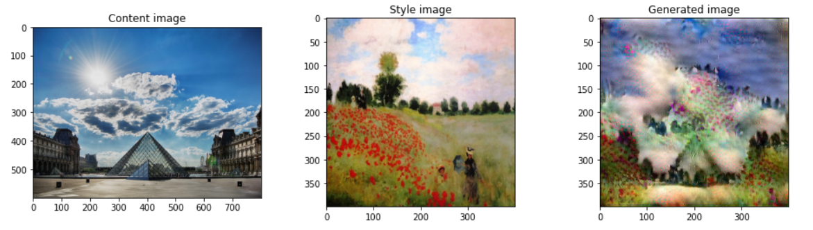

# Neural Style Transfer

Implemented the Neural Style Transfer algorithm that given an input Content image and an input Style image, the algorithm can compose an artistic image which looks like the Content image but is 'painted' in the style of the given Style image.

**Folder structure:**

- images : This contains the input style image and the input content image.
- output : The generated image using the model are stored here
- nst_utils.py: Contains functions for use during loading dataset

**Required libraries**: NumPy, SciPy, Matplotlib, Pillow,Tensorflow, Keras

**Technologies used in this project:**

1. Python
2. Numpy for computation of Cost function
3. Matplotlib for data visualization
4. Tensorflow for model optimization
5. Jupyter notebook, Visual Studio Code and pycharm as IDE

## How to use the model to make predictions?

1. Run the Jupyter Notebook "Neural_Style_Transfer.ipynb". This notebook has step by step explanation for the entire workflow of the code.
2. Run uptil the '5.6: Train the Model' section.
3. Then select the number of epochs. By default epochs is set at 2500 for quick testing
4. Run the training till 20000 steps for remarkably visually pleasing generated image.

## Snapshot

Generated an image by applying the style from a "Claude Monet's impressionist style painting" to a picture of "Louvre Museum,Paris".
The model was run for **20,000 epochs** with a **Learning rate of 0.03**

  

## Workflow of the Jupyter Notebook Code

- [1 - Packages]
- [2 - Problem Statement]
- [3 - Transfer Learning]
- [4 - Neural Style Transfer (NST)]
  - [4.1 - Computing the Content Cost]
    - [4.1.1 - Make Generated Image G Match the Content of Image C]
    - [4.1.2 - Content Cost Function 𝐽𝑐𝑜𝑛𝑡𝑒𝑛𝑡(𝐶,𝐺)]
  - [4.2 - Computing the Style Cost]
    - [4.2.1 - Style Matrix]
      - [gram_matrix]
    - [4.2.2 - Style Cost]
      - [ compute_layer_style_cost]
    - [4.2.3 Style Weights]
      - [ compute_style_cost]
  - [4.3 - Defining the Total Cost to Optimize]
    - [ total_cost]
- [5 - Solving the Optimization Problem]
  - [5.1 Load the Content Image]
  - [5.2 Load the Style Image]
  - [5.3 Randomly Initialize the Image to be Generated]
  - [5.4 - Load Pre-trained VGG19 Model]
  - [5.5 - Compute Total Cost]
    - [5.5.1 - Compute Content Cost]
    - [5.5.2 - Compute Style Cost]
      - [train_step]
  - [5.6 - Train the Model]
